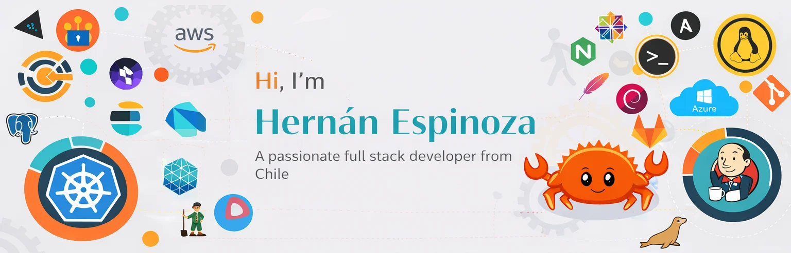

  

---

<h3 align="left">Connect with me:</h3>

<em>Programmer Analyst</em> 

---

<h3 align="left">Languages:</h3>

  
  
  
  

---

<h3 align="left">Front End:</h3>

  
  
  

---

<h3 align="left">Frameworks and Libraries:</h3>

  
  
  
  
  
  
  

---

<h3 align="left">Databases:</h3>

  
  
  
  
  
  

---

<h3 align="left">Cloud & DevOps:</h3>

  
  
  
  

---

<h3 align="left">Tools and Platforms:</h3>

  
  

---
⭐️ From [@Hernán Espinoza Castillo](https://github.com/HernanEspinozaDev) 
